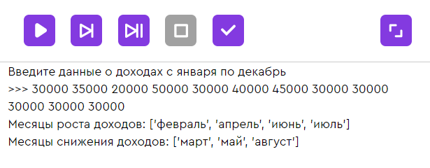
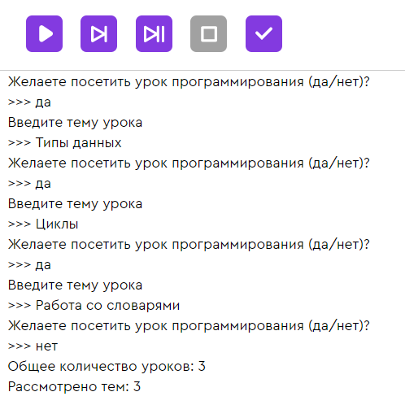

# HACKATHON26-PS2

## TASK 1 -- СПИСКИ
Программа должна запрашивать данные о доходах за каждый из 12 месяцев года. Данные вводятся в одну строку через пробел. Предполагается, что первое число в строке — это доход за январь, а последнее — доход за декабрь того же года.
Программа должна проанализировать данные и вывести названия месяцев с доходом выше, чем в прошлом месяце («Месяцы роста доходов:») и названия месяцев, в которые доход понижался по сравнению с предыдущим показателем («Месяцы снижения доходов:»). Обрати внимание, что названия месяцев должны располагаться в хронологическом порядке.

## TASK 2 -- СЛОВАРИ
Напиши программу, которая будет вести учёт количества проведённых уроков в онлайн-школе программирования MyCode.
План работы программы:
1. Программа спрашивает пользователя, хочет ли он посетить урок программирования.
2. Если пользователь ответил положительно, то программа предлагает ввести тему урока. Заранее известного фиксированного набора тем нет, всё зависит от запросов пользователей.
3. Пункты 1 и 2 повторяются до тех пор, пока пользователь не ответит “нет”.
4. Данные о количестве уроков анализируются и на экран выводится информация о количестве проведённых уроков (“Общее количество уроков:”), а также количестве рассмотренных тем (“Рассмотрено тем:”).

Подсказка: Не знаешь, как считать количество тем, если нет готового списка?
Попробуй организовать хранение данных в словаре: ключи словаря будут названиями тем, а значения — количеством проведённых уроков по каждой теме. Количество занятий по каждой теме может быть больше 1.

